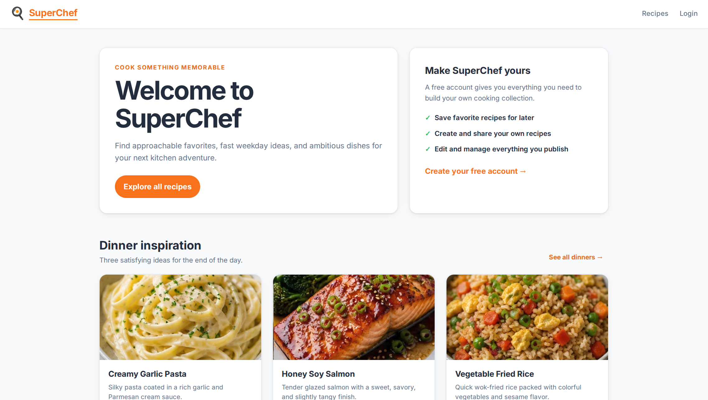

# SuperChef

SuperChef is a website that helps you choose recipes to make.

See it live [https://team5.acnbootcamp.lv/](https://team5.acnbootcamp.lv/)

## prerequisites

Project uses Java 21 and a maven wrapper so the only thing you need is a Java sdk Database is SQLite, templating with
Thymeleaf

If you use mise to manage your dev dependencies jou can install Java with

```bash
mise use -g java@temurin-21
```

## run locally

Clone the repository

```bash
git clone https://github.com/karinasteina/SuperChef.git
cd SuperChef
```

And run

```bash
./mvnw spring-boot:run
```

You can access SuperChef at http://localhost:3500/



## run tests

Tests use H2 in memory database

```bash
./mvnw test
```

## development

for development, you want to set `spring.profiles.active=dev` in your local `.env` file

```bash
cp .env.example .env
```

```bash
./mvnw spring-boot:run -Dspring-boot.run.profiles=prod
```

## deployment

Essentially all that is needed is

build and run tests

```bash
./mvnw clean package
```

then run the complied file

```bash
java -jar target/app-0.0.1-SNAPSHOT.jar
```

The following methods take care of that part

### 1. On portal.acnbootcamp.lv

project includes necessary Dockerfile and GitHub workflow

You just need to change to assigned port and choose container name.

### 2. On your own VPS running [Coolify](https://coolify.io/)

Just add link to your repository and choose Railpack as build tool